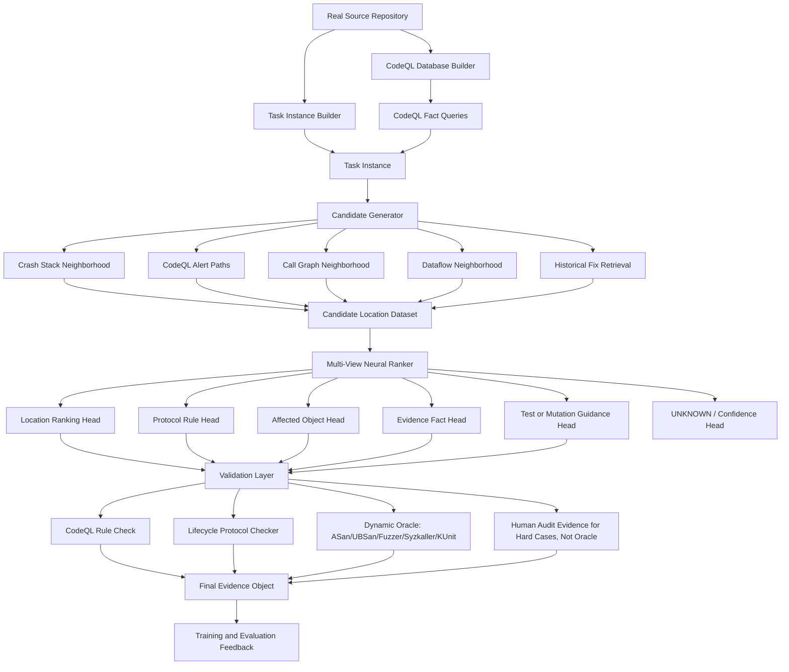

# VulnSignal Foundational Architecture

## Core principle

```text
The model proposes.
The checker/oracle validates.
The dataset stores the full evidence chain.
```

## System diagram



## Component responsibilities

### 1. Task Instance Builder

Creates a real vulnerability-research task from a real project snapshot.

Fields include project, repository snapshot, vulnerable/pre-patch commit, fixed/post-patch commit when available, build/test metadata, crash report or sanitizer stack when available, source sections, and optional patch metadata for training only.

### 2. CodeQL Fact Backbone

Extracts semantic facts from real code: function calls, source lines, AST nodes, local/global data flow, taint paths, free/destroy events, ref acquire/release events, async publish/cancel events, lock/RCU events, and alias candidates.

### 3. Candidate Generator

Builds many candidate locations per task from sanitizer stack frames, CodeQL source/sink paths, functions near crash or patch, call graph neighborhoods, suspicious API usage, and historical similar fixes.

### 4. Multi-View Neural Ranker

Primary model, not an LLM-first design.

Inputs: source-code slice, CodeQL fact tokens, graph/fact paths, optional error/sanitizer context, retrieved historical fixes, lifecycle/protocol rule candidates.

Outputs: suspiciousness score, predicted protocol rule, affected object, relevant evidence facts, mutation/test guidance, UNKNOWN/confidence.

### 5. Validation Layer

The model output is checked. Validation result is PASS, FAIL, or UNKNOWN. UNKNOWN is first-class, not a failure.

Human audit may add review evidence for hard cases, but human or LLM review is not an oracle by itself. Final truth still requires a dynamic oracle, CodeQL-backed conditional rule check, patch-confirmed before/after behavior tied to evidence, or explicit UNKNOWN.

### 6. Dataset Feedback

Stores every result as evidence: model proposal, CodeQL facts, checker result, dynamic oracle result, final label source, explanation, and limitations.

## Architecture boundary

VulnSignal does not require full autonomous agents.

VulnSignal trains one useful operation inside an agentic security pipeline:

```text
candidate ranking + protocol hypothesis + test guidance
```
